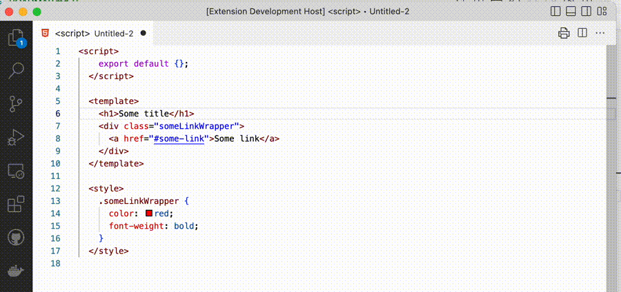

# Text Tokenizer

This extension is meant to improve the process of replacing text parts with some tokens (e.g. localization of hardcoded values). It is designed to be framework agnostic, so make sure to configure it to achieve the best experience.

## How does it work?

Each time you replace a string with a token it is stored in memory. You can make multiple replacement operations one by one and finally generate the results as a JSON file which can be easily processed for any application.



## Configuration

### text-tokenizer.tokenWrapper

As you would usually need a token inside some wrapper (e.g. localization function or HTML tag), you can define a `text-tokenizer.tokenWrapper` param in the [workspace settings](https://code.visualstudio.com/docs/getstarted/settings):

```json
{
  "text-tokenizer.tokenWrapper": "$translate(\"%token%\")"
}
```

### text-tokenizer.tokenCollectionGetter

If you wish to have the functionality of getting code lens hints for your existing tokens (in-memory ones would be shown anyway) you need to provide the path to the file with the default export of the function which returns an array of tokens and values in the following format:

```javascript
export default async function () {
  /**
   * TODO: Write some file loader and parser example
   */
  return await Promise.resolve([
    {
      token: "first.token",
      value: "First token",
    },
    {
      token: "second.token",
      value: "Second token",
    },
  ]);
}
```

## Commands

### Text tokenizer: Replace selection with a token

Select a text fragment you wish to replace and execute the command. You'll see a prompt, enter a token, and it would replace your selection.
You can execute the command multiple times. All selected text-token pairs would be stored until you run the "Text tokenizer: Generate results and clean cache" command.

### Text tokenizer: Generate results and clean cache

This command would open a new document with all replaced selection-to-token pairs.
**The text tokenizer store would be cleaned, so copy the result before closing the generated document**

```json
[
  {
    "token": "token.one",
    "value": "selection-1"
  },
  {
    "token": "token.two",
    "value": "selection-2"
  }
]
```
