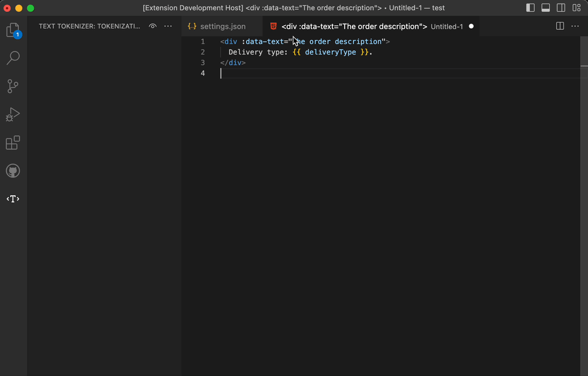
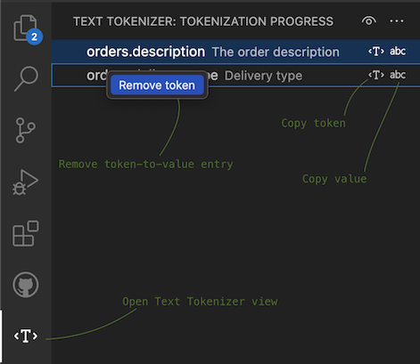

# Text Tokenizer (localization)

This extension is developed to improve the process of replacing text parts with tokens (e.g. localization of hardcoded values) and to provide visual hints. To enable all features it's required to configure the extension.

## Usage example

- We have an application with hardcoded texts and need to localize it.
- Translation JSON files should be in the `i18n/` folder in `[ { token: "token", value: "value" } ]` format.
- In Typescript files should use `translate(token)` helper
- HTML should use interpolation: `{{ $translate(token) }}`.

First, configure how the extension should replace strings in different file types. Open [workspace settings](https://code.visualstudio.com/docs/getstarted/settings) and add the following config.

```json
"text-tokenizer.tokenWrappersByLanguageId": {
  "html": "{{ $translate(\"%token%\") }}",
  "typescript": "translate(\"%token%\")"
},
```

Second, configure how the extension should detect tokens.

```json
"text-tokenizer.tokenLookupRegExps": [
  "translate\\([\\n\\s\\r]*?(['\"`])(?<token>.+?)\\1"
],
```

Then start tokenization. Select a hardcoded string and run "Replace selection with a token" command. When everything is ready, run "Finish tokenization" command.



Finally, save the generated JSON as `i18n/locale.en.json` file and configure the extension to read values from the file to have inline hints.

```json
{
  "text-tokenizer.tokenCollectionGetter": "json-array",
  "text-tokenizer.tokenCollectionPath": "/Users/username/projects/my-project/i18n/locale.en.json"
}
```

## UI overview

Extension has a basic UI to track the tokenization progress and perform actions.

 

## Configuration examples

### **text-tokenizer.tokenWrappersByLanguageId**

To have different wrappers for different file types you can define a `text-tokenizer.tokenWrappersByLanguageId` param. It relies on [language ID](https://code.visualstudio.com/docs/getstarted/tips-and-tricks#_change-language-mode) detected by VS Code:

```json
{
  "text-tokenizer.tokenWrappersByLanguageId": {
    "html": "{{ $translate(\"%token%\") }}",
    "typescript": "useTranslator(\"%token%\")"
  }
}
```

### **text-tokenizer.tokenLookupRegExps**

It is possible to provide multiple regular expressions to let the extension to look up for different patterns to extract token. Each regular expression should have "token" named capturing group.

```json
{
  "text-tokenizer.tokenLookupRegExps": [
    "translate\\((['\"`])(?<token>.+?)\\1\\)",
    "useTranslator\\((['\"`])(?<token>.+?)\\1\\)"
  ]
}
```

### **text-tokenizer.tokenCollectionPath**

The option should be set up with the `text-tokenizer.tokenCollectionGetter`. It is used to extract tokens from some file and watch changes.

- The path should be **absolute**.
- If `text-tokenizer.tokenCollectionGetter` is set to the preset (e.g. `json-array`, `json-map`) the path should point to a valid **JSON** file.
- If `text-tokenizer.tokenCollectionGetter` is a path to a custom function, this path would be used only for tracking file changes to get token updates.

```json
{
  "text-tokenizer.tokenCollectionPath": "/absolute/path/to/file.json"
}
```

### **text-tokenizer.tokenCollectionGetter**

The option should be set to enable inline hints feature. Use a preset or a custom function. Available values:

- `json-map` would read JSON file from `text-tokenizer.tokenCollectionPath`

```json
// Workspace settings
{
  "text-tokenizer.tokenCollectionGetter": "json-map",
  "text-tokenizer.tokenCollectionPath": "/absolute/path/to/token-collection.json"
}

// token-collection.json
{
  "token1": "value1",
  "token2": "value2",
  ...
}
```

- `json-array` would read JSON file from `text-tokenizer.tokenCollectionPath`

```json
// Workspace settings
{
  "text-tokenizer.tokenCollectionGetter": "json-array",
  "text-tokenizer.tokenCollectionPath": "/absolute/path/to/token-collection.json"
}

// token-collection.json
[
  {
    "token": "token1",
    "value": "value1"
  },
  {
    "token": "token2",
    "value": "value2"
  }
]
```

- `/absolute/path/to/token-getter-function.js` – should point to a file with default export of a function which **returns a Promise**

```javascript
// Workspace settings
{
  "text-tokenizer.tokenCollectionGetter": "/absolute/path/to/token-getter-function.js",
  "text-tokenizer.tokenCollectionPath": "/absolute/path/to/token-collection.json"
}

// token-collection.json
{
  tokens: [
    {
      "token": "token.number.one",
      "value": "The corresponding value One"
    },

    {
      "token": "token.number.two",
      "value": "The corresponding value Two"
    }
  ]
}

// token-getter-function.js
const { readFile } = require("fs/promises");

module.exports = async function (tokenCollectionPath) {
  const fileContent = await readFile(tokenCollectionPath, {
    encoding: "utf-8",
  });

  return JSON.parse(fileContent).tokens;
};

```

Inline hints would be helpful if basic "mouseover hints" configuration is done.

### **text-tokenizer.inlineHints**

Enable or disable inline hints. It would visualize values preview for each token and mark tokens without values.

```json
{
  "text-tokenizer.inlineHints": true
}
```

### **text-tokenizer.inlineValueCSS**

CSS to be applied to inline hints when value is found.

```json
{
  "text-tokenizer.inlineValueCSS": "display: inline-block;margin: 0 5px 0 5px;padding: 0 5px 0 5px;"
}
```

### **text-tokenizer.inlineValueNotFoundCSS**

CSS to be applied to inline hints when value is not found.

```json
{
  "text-tokenizer.inlineValueNotFoundCSS": "display: inline-block;margin: 0 5px 0 5px;padding: 0 5px 0 5px;"
}
```

## Commands

### Text tokenizer: Replace selection with a token

Select a text fragment you wish to replace and execute the command. You'll see a prompt, enter a token, and it would replace your selection.
You can execute the command multiple times. All selected text-token pairs would be stored until you run the "Text tokenizer: Generate results and clean cache" command.

### Text tokenizer: Generate results and clean cache

This command would open a new document with all replaced selection-to-token pairs.
**The text tokenizer store would be cleaned, so copy the result before closing the generated document**

```json
[
  {
    "token": "token.one",
    "value": "selection-1"
  },
  {
    "token": "token.two",
    "value": "selection-2"
  }
]
```

## Limitations

I'm trying to improve this extension in my free time, but still there is much to do. The most important limitation is caused by the fact that now this extension relies on **RegExps**, so:

- it can't detect dynamic tokens like `errors.${key}` (language server implementation PR would be welcome).
